# RiceDash Architecture Flow Chart

## 🏗️ System Architecture Overview

```mermaid
graph TB
    %% External Services
    subgraph "External Services"
        GM[Google Maps API]
        GMAuth[Google OAuth]
        GHAuth[GitHub OAuth]
        Vercel[Vercel Platform]
        PostgresDB[(PostgreSQL Database)]
    end

    %% Frontend Layer
    subgraph "Frontend Layer (Next.js 15.2.2)"
        subgraph "Pages & Routes"
            HomePage["🏠 Home Page<br/>/"]
            OrderPage["🛒 Order Page<br/>/order"]
            DasherPage["🚚 Dasher Dashboard<br/>/dasher"]
            LoginPage["🔐 Login Page<br/>/login"]
            RegisterPage["📝 Register Page<br/>/register"]
        end
        
        subgraph "UI Components"
            Navbar["🧭 Navbar"]
            GoogleMap["🗺️ Google Map Component"]
            MapSelector["📍 Map Selector"]
            AuthForm["🔑 Auth Form"]
            Hero["🎯 Hero Section"]
            Footer["📄 Footer"]
        end
        
        subgraph "UI Library (shadcn/ui)"
            Button["🔘 Button"]
            Card["📋 Card"]
            Select["📝 Select"]
            Input["📥 Input"]
            Badge["🏷️ Badge"]
            Switch["🔄 Switch"]
        end
    end

    %% Backend Layer
    subgraph "Backend Layer (Next.js API Routes)"
        subgraph "API Endpoints"
            OrdersAPI["📦 /api/orders<br/>POST: Create Order<br/>GET: Get User Orders"]
            DasherAPI["🚚 /api/dasher/orders<br/>GET: Get Available Orders"]
            DistanceAPI["📏 /api/distance<br/>POST: Calculate Distance/Time"]
            AuthAPI["🔐 /api/auth/[...nextauth]<br/>Authentication Routes"]
        end
        
        subgraph "Authentication System"
            NextAuth["NextAuth.js 5.0.0-beta.25"]
            Credentials["Credentials Provider"]
            GoogleProvider["Google Provider"]
            GitHubProvider["GitHub Provider"]
            SessionMgmt["Session Management"]
        end
    end

    %% Database Layer
    subgraph "Database Layer (Drizzle ORM + PostgreSQL)"
        subgraph "Database Schema"
            UsersTable["👥 Users Table<br/>• id (UUID)<br/>• firstName, lastName<br/>• riceEmail (unique)<br/>• phoneNumber<br/>• passwordHash<br/>• isDeliveryDriver<br/>• driverStatus<br/>• createdAt"]
            
            OrdersTable["📦 Orders Table<br/>• id (UUID)<br/>• customerId (FK)<br/>• deliveryPersonId (FK)<br/>• serveryName (enum)<br/>• orderItemsJSON<br/>• status (enum)<br/>• paymentStatus (enum)<br/>• totalAmount<br/>• deliveryLocation<br/>• orderTimestamp<br/>• deliveryRating"]
        end
        
        subgraph "Database Queries"
            UserQueries["👤 User Queries<br/>• createUser()<br/>• getUser()<br/>• setUserAsDriver()<br/>• setDriverStatus()<br/>• getAvailableDrivers()"]
            
            OrderQueries["📦 Order Queries<br/>• createOrder()<br/>• getPendingOrders()<br/>• getRecentOrdersWithCustomers()<br/>• acceptOrder()"]
        end
    end

    %% Data Flow Connections
    HomePage --> Navbar
    OrderPage --> GoogleMap
    OrderPage --> MapSelector
    DasherPage --> GoogleMap
    LoginPage --> AuthForm
    RegisterPage --> AuthForm

    %% API Connections
    OrderPage --> OrdersAPI
    DasherPage --> DasherAPI
    GoogleMap --> DistanceAPI
    AuthForm --> AuthAPI

    %% Authentication Flow
    AuthAPI --> NextAuth
    NextAuth --> Credentials
    NextAuth --> GoogleProvider
    NextAuth --> GitHubProvider
    NextAuth --> SessionMgmt

    %% Database Connections
    OrdersAPI --> UserQueries
    OrdersAPI --> OrderQueries
    DasherAPI --> OrderQueries
    UserQueries --> UsersTable
    OrderQueries --> OrdersTable
    OrderQueries --> UsersTable

    %% External Service Connections
    GoogleMap --> GM
    GoogleProvider --> GMAuth
    GitHubProvider --> GHAuth
    UsersTable --> PostgresDB
    OrdersTable --> PostgresDB
    Vercel --> HomePage
    Vercel --> OrderPage
    Vercel --> DasherPage
    Vercel --> OrdersAPI
    Vercel --> DasherAPI
    Vercel --> DistanceAPI
    Vercel --> AuthAPI

    %% Styling
    classDef frontend fill:#e1f5fe,stroke:#01579b,stroke-width:2px
    classDef backend fill:#f3e5f5,stroke:#4a148c,stroke-width:2px
    classDef database fill:#e8f5e8,stroke:#1b5e20,stroke-width:2px
    classDef external fill:#fff3e0,stroke:#e65100,stroke-width:2px
    classDef api fill:#fce4ec,stroke:#880e4f,stroke-width:2px

    class HomePage,OrderPage,DasherPage,LoginPage,RegisterPage,Navbar,GoogleMap,MapSelector,AuthForm,Hero,Footer,Button,Card,Select,Input,Badge,Switch frontend
    class OrdersAPI,DasherAPI,DistanceAPI,AuthAPI,NextAuth,Credentials,GoogleProvider,GitHubProvider,SessionMgmt backend
    class UsersTable,OrdersTable,UserQueries,OrderQueries database
    class GM,GMAuth,GHAuth,Vercel,PostgresDB external
    class OrdersAPI,DasherAPI,DistanceAPI,AuthAPI api
```

## 🔄 User Flow Diagrams

### Customer Order Flow

### Dasher Order Management Flow

### Authentication Flow

## 🗄️ Database Schema Relationships

## 🛠️ Technology Stack Breakdown

### Frontend Technologies
- **Next.js 15.2.2** - React framework with App Router
- **React 18.2.0** - UI library with hooks
- **TypeScript 5.6.3** - Type-safe development
- **Tailwind CSS 3.4.1** - Utility-first styling
- **shadcn/ui** - Component library
- **Framer Motion 11.3.19** - Animations
- **Lucide React** - Icons

### Backend Technologies
- **Next.js API Routes** - Serverless endpoints
- **Drizzle ORM 0.34.1** - Type-safe database toolkit
- **PostgreSQL** - Primary database
- **bcrypt-ts** - Password hashing
- **Zod** - Runtime validation

### Authentication & Security
- **NextAuth.js 5.0.0-beta.25** - Authentication framework
- **OAuth Providers** - Google, GitHub
- **Credentials Provider** - Email/password
- **Session Management** - Secure sessions

### External Services
- **Google Maps JavaScript API** - Maps and geolocation
- **Google Maps Distance Matrix API** - Route calculation
- **Vercel Postgres** - Database hosting
- **Vercel Platform** - Deployment and hosting

### Development Tools
- **Biome** - Linting and formatting
- **Playwright** - E2E testing
- **pnpm** - Package manager
- **Drizzle Kit** - Database migrations

## 📊 Data Flow Architecture

```mermaid
graph LR
    subgraph "Client Side"
        Browser[🌐 Browser]
        React[⚛️ React Components]
        State[📊 State Management]
    end
    
    subgraph "Server Side"
        NextJS[⚡ Next.js Server]
        API[🔌 API Routes]
        Auth[🔐 Authentication]
    end
    
    subgraph "Data Layer"
        Drizzle[🗄️ Drizzle ORM]
        Postgres[(🐘 PostgreSQL)]
    end
    
    subgraph "External APIs"
        Maps[🗺️ Google Maps]
        OAuth[🔑 OAuth Providers]
    end
    
    Browser --> React
    React --> State
    React --> NextJS
    NextJS --> API
    API --> Auth
    API --> Drizzle
    Drizzle --> Postgres
    React --> Maps
    Auth --> OAuth
    
    classDef client fill:#e3f2fd,stroke:#1976d2,stroke-width:2px
    classDef server fill:#f3e5f5,stroke:#7b1fa2,stroke-width:2px
    classDef data fill:#e8f5e8,stroke:#388e3c,stroke-width:2px
    classDef external fill:#fff3e0,stroke:#f57c00,stroke-width:2px
    
    class Browser,React,State client
    class NextJS,API,Auth server
    class Drizzle,Postgres data
    class Maps,OAuth external
```

## 🚀 Deployment Architecture

```mermaid
graph TB
    subgraph "Development Environment"
        Local[💻 Local Development]
        DevDB[(🗄️ Local PostgreSQL)]
    end
    
    subgraph "Production Environment (Vercel)"
        CDN[🌐 Vercel CDN]
        Edge[⚡ Edge Functions]
        Serverless[☁️ Serverless Functions]
        ProdDB[(🗄️ Vercel Postgres)]
    end
    
    subgraph "External Services"
        MapsAPI[🗺️ Google Maps API]
        OAuthAPI[🔑 OAuth APIs]
    end
    
    Local --> DevDB
    CDN --> Edge
    Edge --> Serverless
    Serverless --> ProdDB
    Serverless --> MapsAPI
    Serverless --> OAuthAPI
    
    classDef dev fill:#e8f5e8,stroke:#2e7d32,stroke-width:2px
    classDef prod fill:#e3f2fd,stroke:#1565c0,stroke-width:2px
    classDef external fill:#fff3e0,stroke:#ef6c00,stroke-width:2px
    
    class Local,DevDB dev
    class CDN,Edge,Serverless,ProdDB prod
    class MapsAPI,OAuthAPI external
```

## 🔧 Key Features & Components

### Core Features
1. **Multi-Servery Ordering** - Order from all 5 Rice serveries
2. **Real-time Order Tracking** - Live order status updates
3. **Interactive Maps** - Google Maps integration for locations
4. **Secure Authentication** - Multiple login options
5. **Dasher Management** - Driver dashboard and order management
6. **Order History** - Past orders and ratings

### Component Architecture
- **Page Components** - Route-based page components
- **UI Components** - Reusable shadcn/ui components
- **Custom Components** - Rice-specific functionality
- **Map Components** - Google Maps integration
- **Auth Components** - Authentication forms and providers

### API Architecture
- **RESTful Endpoints** - Standard HTTP methods
- **Type Safety** - Full TypeScript coverage
- **Error Handling** - Comprehensive error responses
- **Authentication** - Protected routes and sessions
- **Validation** - Input validation with Zod

This architecture provides a scalable, maintainable, and secure food delivery platform specifically designed for Rice University students, with modern web technologies and best practices throughout the stack.
